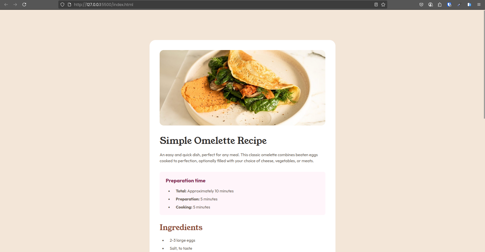
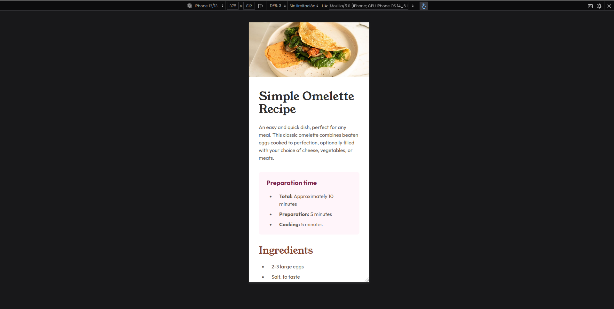

# 🍳 Frontend Mentor - Recipe Page

This is a solution to the [Recipe page in Frontend Mentor](https://www.frontendmentor.io/learning-paths/getting-started-on-frontend-mentor-XJhRWRREZd/steps/66e1acc75832c087f249d57a/challenge/start) challenge on Frontend Mentor. It's a project focused on responsive design using **Tailwind CSS**, with an emphasis on semantic HTML structure, clean visuals, and modern coding practices.

## 📌 Summary

In this project, I built a clean and simple recipe page that includes a title, image, description, preparation time, ingredients, instructions, and nutrition information. It was a great opportunity to improve my Tailwind CSS skills and practice responsive layout, typography, and structured content.

## 📸 Screenshots

### 🖥️ Desktop view

### 📱 Mobile view

## 🌐 Live Preview

- 🔗 **Live web page**: [https://michaeljara905.github.io/Recipe-page-main/](https://michaeljara905.github.io/Recipe-page-main/)
- 💻 **Source code**: [https://github.com/MichaelJara905/Recipe-page-main.git](https://github.com/MichaelJara905/Recipe-page-main.git)

## 🛠️ Technology Stack

- Semantic HTML5
- Tailwind CSS
- Custom fonts (locally hosted Google Fonts)
- Responsive design (mobile-first approach)

## My workflow
### 📁 Project Setup

- Used an `input.css` file as the main entry point for Tailwind CSS, where:
  - Tailwind’s base, components, and utilities are imported using `@import "tailwindcss"`.
  - Custom fonts are loaded via `@font-face` (Outfit and Young Serif).
  - CSS variables are declared under `@theme` for consistent color and typography use across the project.
- The file is compiled using **PostCSS** to generate the final stylesheet.
- Well-structured folder system for fonts (`/assets/fonts`) and images.

### 🧱 Structure and Layout

- Built using semantic HTML tags (`<article>`, `<section>`, `<header>`) for better accessibility.
- Layout and components are created with Tailwind utility classes (`rounded`, `shadow`, `px`, `mt`, etc.).

### 🎨 Styling

- Custom color palette defined with HSL values using CSS variables like `--color-stone-600`, `--color-rose-50`, etc.
- Fonts used:
  - **Outfit**: for body text and secondary elements.
  - **Young Serif**: for prominent headings.
- Tailwind utilities were used for spacing, typography, and responsive behavior (`sm:`, `md:`).

### 🚀 Deployment

- Project deployed using GitHub Pages for easy public access on any device.

## 📚 What I Learned

- How to extend Tailwind with locally hosted custom fonts.
- How to define and use custom CSS variables for consistent design.
- Improved skills in responsive layout and semantic structure.
- Practiced clean, accessible, and scalable frontend development with Tailwind CSS.

## 🔍 What I Would Do Differently

- Add dark/light mode support using Tailwind’s `dark:` utilities.
- Include subtle animations on scroll or when elements appear.
- Refactor layout into components for use with React or Vue.
- Add a contact form or comment system for recipe feedback.

Define variables for later use

    @font-face {

        font-family: 'Outfit';
        src: url('/assets/fonts/outfit/static/Outfit-Regular.woff2') format('woff2');
        font-weight: 400;
        font-style: normal;
        font-display: swap;
    }

    @font-face {

        font-family: 'Outfit';
        src: url('/assets/fonts/outfit/static/Outfit-Semibold.woff2') format('woff2');
        font-weight: 600;
        font-style: normal;
        font-display: swap;
    }

    @font-face {

        font-family: 'Outfit';
        src: url('/assets/fonts/outfit/static/Outfit-Bold.woff2') format('woff2');
        font-weight: 700;
        font-style: normal;
        font-display: swap;
    }

    @font-face {

        font-family: 'Young Serif';
        src: url('/assets/fonts/young-serif/YoungSerif-Regular.woff2') format('woff2');
        font-weight: 400;
        font-style: normal;
        font-display: swap;
    }

    @theme {

        /* Variables de colores */
        --color-white: hsl(0, 0%, 100%);

        --color-stone-100: hsl(30, 54%, 90%);
        --color-stone-150: hsl(30, 18%, 87%);
        --color-stone-600: hsl(30, 10%, 34%);
        --color-stone-900: hsl(24, 5%, 18%);

        --color-brown-800: hsl(14, 45%, 36%);

        --color-rose-800: hsl(332, 51%, 32%);
        --color-rose-50: hsl(330, 100%, 98%);

        /* Variables de tipografía */
        --font-outfit: 'Outfit', system-ui, sans-serif;
        --font-young-serif: 'Young Serif', system-ui, sans-serif;
    }

## 👤 Author

- Frontend Mentor - [@MichaelJara905](https://www.frontendmentor.io/profile/MichaelJara905)
- Instagram - [@jaramillo_maicol_0](https://instagram.com/jaramillo_maicol_0)
- GitHub - [@MichaelJara905](https://github.com/MichaelJara905)

## ✅ Conclusion

This challenge was a great way to reinforce key frontend skills like content-focused layout, visual hierarchy, and Tailwind customization. Each project strengthens my foundation as a frontend developer.

